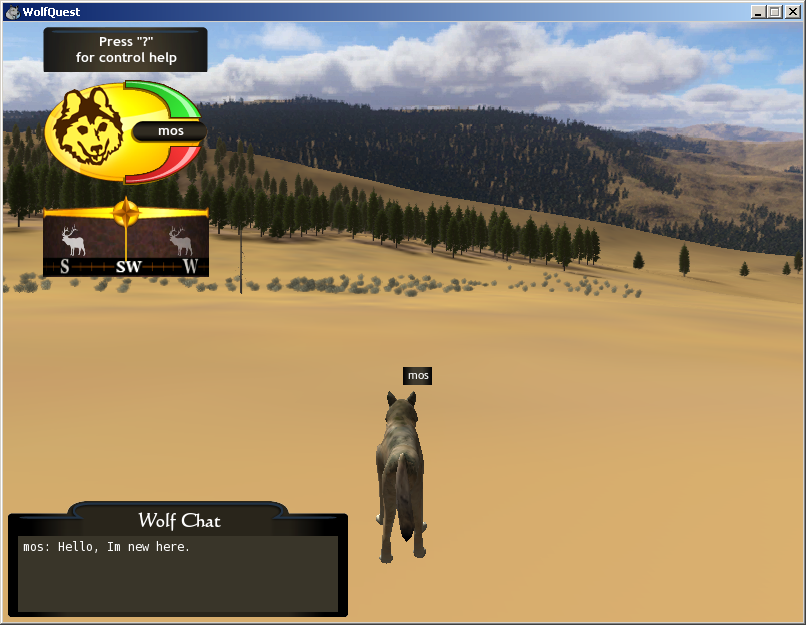

# WolfQuest2.5-Multiplayer
Multiplayer support for WolfQuest 2.5.1

## Overview
WolfQuest is a 3D wildlife simulation video game originally developed by the Minnesota Zoo and game developer company Eduweb.  The game has gone through periodic development across several revisions:
* **WolfQuest Legacy**, the first iteration.  Reached version 2.5.1 in October of 2011, after which development ceased for several years.  Released for free on the developer's webpage.
* **WolfQuest Classic**, development resumed in 2014 and reached version 2.7 (released November 2015).  Requiring a one-time purchase to play.
* **WolfQuest Anniversary**, the current build, first launched in 2019 and still receiving content updates.  As with Classic, requires a purchase to play.

The more recent versions are available from Steam and itch.io, and still have working multiplayer servers.  However, WolfQuest Legacy's multiplayer system shut down years ago.  This project recreates the infrastructure allowing multiplayer for WolfQuest Legacy to work again.



## Details
The following features need to be staged for WolfQuest Legacy multiplayer to function.  The outline goes like this:

### `assets25/WQ_MP_WolfQuest_2_0_0.unity3d`
At launch during multiplayer initialization, WolfQuest makes a request to download this file from <http://wolfquest.org/assets25/WQ_MP_WolfQuest_2_0_0.unity3d>.  It's not clear what this is for, but it is archived here so that a replacement WolfQuest.org web server can serve a copy of the same file.

**Set up a web server and serve this file to connecting clients.**

### Unity Networking Servers
Unity3d formerly offered a free Master Server product, which allowed users to register and locate player-run servers from a centralized list.  This has been disabled for many years.  Fortunately, it is possible to run your own.  This repository contains modified versions of the RakNet-based Unity Networking Servers for Unity 3.x.  The source code was obtained from <https://unity3d.com/master-server> and mirrored here.  Modifications to the code are based on [this Unity forum thread](https://discussions.unity.com/t/unity-master-server-ubuntu-build-problem/67603/4), which allows building on Linux with a newer C compiler.

**Build MasterServer and ConnTester, then launch them on a publically available IP address.**

### `bb/vuser4.php`
After communicating with the Master Server, WolfQuest does one additional check to verify the player-supplied username and password against its bulletin board user list.  The game makes a GET request to <http://www.wolfquest.org/bb/vuser4.php> with the username / password combination to verify that the player may connect.

An example PHP script, which always returns success if `uname` is nonblank, is provided in the `web/` folder.  Details of the protocol are in the comments.

**Stage the vuser4.php script on the web server from step 1.**

### Change player hosts
Lastly, clients need a way to find your new services.

The simplest way is to change your Windows `HOSTS` file and add entries for the new services.  Replace the IP addresses with that of your new server:

```
255.255.255.255 wolfquest.org
255.255.255.255 www.wolfquest.org
255.255.255.255 masterserver.unity3d.com
255.255.255.255 connectiontester.unity3d.com
255.255.255.255 facilitator.unity3d.com
```

Once done and saved, WolfQuest should be able to locate the master server, create games, pass authentication, and allow multiplayer hosting.

Note that changing these have system-wide effects - you should delete these lines when done playing, so that other programs are not impacted!

## Extra
Here are some extra notes about the items in this repository.

### Network Details
Some hints about the Networking Servers:

* **Master Server**
  This is fairly self-explanatory: binds to a single UDP port (default 23466), accepts server registrations, and sends the list to clients on demand.

* **Connection Tester**
  Connection Tester is a tool for helping identify what form of NAT a client might be using.  Its operation is described somewhat in [the RakNet documentation](http://www.raknet.net/raknet/manual/natpunchthrough.html).  In order to work correctly, **it requires 4 IP addresses** (at least 2 public and fixed, the other 2 may be virtual / shared).  The general theory is that it takes a message from a client on one fixed IP (UDP port 10737), then sends a response on a second (fixed or dynamic) one, and the client's behavior can be used to determine what sort of NAT, if any, is in use.  The probe happens twice, hence four IPs total.

  If you don't have four IP addresses, edit line 256 and change `if (ipCount < 4)` to `if (ipCount < 1)`, then run the server and bind the same address multiple times, as in `./ConnTester -h 0.0.0.0 -b 0.0.0.0 0.0.0.0 0.0.0.0`.  This will work for non-NAT player servers, but obviously detection of NAT type will no longer work.

* **Facilitator / Proxy Server**
  Required for doing NAT punchthrough, both parties must be connected to the same Facilitator.  Proxy Server can be used for proxying traffic from clients to servers they otherwise could not connect to.  The two work together, though I am not sure how: WolfQuest made a DNS query to the Facilitator address but I have never seen it actually use these services.

For more information see the [Master Server Build](https://docs.unity3d.com/2018.1/Documentation/Manual/net-MasterServer.html) manual page.

### Links
* <https://www.wolfquest.org> - the WolfQuest webpage
* <https://www.wolfquest.org/downloads25a1.php> - Download page for the Legacy version
